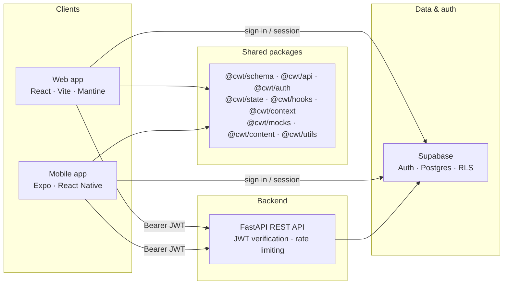

# Torque

**An AI-assisted calisthenics workout tracker — built solo, currently in active development (v0.1.1-alpha.2).**

Torque lets users log bodyweight workouts, track set progressions (challenge/assist variations), and build a training history — with an AI-generated workout feature planned for a later release.

**Live demo:** [Torque](https://torquefit.app)

**Changelog:** [CHANGELOG.md](./CHANGELOG.md)

**Release notes:** [docs/releases/](./docs/releases/)

## Screenshots/Demos

### Web

https://github.com/user-attachments/assets/c631c329-59ae-4198-83be-f7a1377510c5

https://github.com/user-attachments/assets/0f61a7f4-9f7e-4483-8a52-37fc91ed8b90

https://github.com/user-attachments/assets/75627732-bdcc-48b9-a037-7bb640f046cd

### Mobile

https://github.com/user-attachments/assets/70655694-d05a-479a-9221-d51201f0663a

https://github.com/user-attachments/assets/e9fe9637-f7fc-4ead-902b-fb65578c8126

https://github.com/user-attachments/assets/b8381776-0256-4bc0-9b85-51cfe1c2d0a2

https://github.com/user-attachments/assets/60e5360b-529c-449a-8e0c-62006feb719a

---

## Status

This project is under active development. The current build (`v0.1.1-alpha.1`) covers core account, logging, and history features — enough for a working demo, not yet feature-complete. See the [roadmap](#roadmap) below for what's next.

---

## What it does (alpha.1)

- **Account creation & login** — Supabase Auth
- **Exercise library** — 100+ bodyweight exercises (push-ups, pull-ups, dips, squats, core, handstand progressions), each tagged with target muscles, equipment, and difficulty
- **Workout builder** — log sets, reps, and timed holds; organize with sections and supersets; reorder freely
- **Set progressions** — track challenge (added difficulty, e.g. weighted vest) and assist (reduced difficulty, e.g. resistance bands) variations per exercise
- **Workout history** — chronological logbook of completed sessions

## Roadmap

| Version | Focus                                                                     |
| ------- | ------------------------------------------------------------------------- |
| alpha.2 | Progressions library, onboarding, profile/settings, calendar logbook view |
| alpha.3 | Progression tracking — detailed status and history per skill              |
| alpha.4 | AI workout generator (GPT 4o mini)                                        |
| beta.1  | Testing, advanced auth, security hardening, UI/UX polish                  |

---

## Architecture

pnpm + Turborepo monorepo. Web and mobile share typed packages; each app has its own UI layer.

### System overview



**Request flow:** clients authenticate with Supabase Auth, attach the access token to API calls, and the FastAPI backend verifies JWTs via Supabase JWKS before reading or writing data through the Supabase client.

**Local modes:** `local-isolated` returns mock data on the client and relaxes backend auth for offline work; `local-integration` runs the full web/mobile → API → Supabase stack.

### Monorepo layout

```
calisthenics-workout-tracker/
├── apps/
│   ├── backend/                    # @cwt/backend — FastAPI (Python, Poetry)
│   │   └── app/
│   │       ├── api/routes/         # exercises, workout, set-progressions
│   │       ├── core/               # config, JWT dependencies
│   │       ├── schemas/            # Pydantic request/response models
│   │       └── services/           # Supabase client
│   └── frontend/
│       ├── web/                    # @cwt/web — Vite + TanStack Router
│       │   └── src/
│       │       ├── routes/         # file-based pages (_site, _auth)
│       │       ├── components/
│       │       └── services/       # env-specific API wrappers
│       └── mobile/                 # @cwt/mobile — Expo + React Navigation
│           ├── screens/
│           ├── components/
│           ├── navigation/
│           └── services/
├── packages/                       # shared TypeScript libraries
│   ├── api/                        # HTTP client + REST service functions
│   ├── auth/                       # Supabase auth helpers
│   ├── content/
│   ├── context/                    # WorkoutContext provider
│   ├── hooks/                      # auth forms, data-fetch hooks
│   ├── mocks/                      # sample exercises, builds, logs
│   ├── schema/                     # Zod schemas + DB types
│   ├── state/                      # Zustand stores (workout draft, auth, …)
│   └── utils/
├── docs/                           # schemas, release notes, security checklist
├── turbo.json
└── pnpm-workspace.yaml
```

### Shared packages (web + mobile)

| Package                       | Role                                                                        |
| ----------------------------- | --------------------------------------------------------------------------- |
| `@cwt/schema`                 | Zod validation and TypeScript types (including Supabase-generated DB types) |
| `@cwt/api`                    | Typed fetch helpers for backend endpoints                                   |
| `@cwt/auth`                   | Supabase sign-in, sign-up, session utilities                                |
| `@cwt/state`                  | Zustand stores for auth, exercises, workout draft/save flow                 |
| `@cwt/hooks`                  | Reusable React hooks (auth forms, confirmations, etc.)                      |
| `@cwt/context`                | Cross-cutting React context (e.g. workout state provider)                   |
| `@cwt/mocks`                  | Sample data for `local-isolated` development                                |
| `@cwt/content` · `@cwt/utils` | Shared content and helper utilities                                         |

UI is **not** shared — web uses Mantine; mobile uses React Native Paper and native components.

### Backend API surface

| Route prefix            | Purpose                                     |
| ----------------------- | ------------------------------------------- |
| `GET/POST /workout/*`   | Save and retrieve workout builds and logs   |
| `GET /exercises`        | Exercise library with filters               |
| `GET /set-progressions` | Challenge and assist progressions           |
| `GET /`, `GET /info`    | Health and app metadata (strict rate limit) |

Rate limits: 3 req/min (health), 60 req/min (reads), 10 req/min (writes). See [CHANGELOG.md](./CHANGELOG.md) for v0.1.0-alpha.2 details.

### Data model

- **Supabase Postgres** with Row Level Security
- Workout builds and logs store structured **`workout_data` JSON** (schema-validated; see `docs/workout_data_json_schema_v3.json`)
- Exercises, progressions, and user-scoped workout rows live in relational tables

### State & validation

- **Zustand** (`@cwt/state`) for client-side workout drafting and app state
- **Zod** (`@cwt/schema`) at API boundaries on the frontend; **Pydantic** on the backend

### Testing

| Layer   | Stack                         |
| ------- | ----------------------------- |
| Web     | Vitest, React Testing Library |
| Mobile  | Jest (jest-expo)              |
| Backend | Pytest, pytest-asyncio        |

Further schema and release documentation: [`docs/`](./docs/).

## Tech Stack

**Frontend:** React, React Native (Expo), Vite, Mantine, TanStack Router, Zustand, Zod, React Hook Form
**Backend:** FastAPI, Pydantic, Uvicorn, Pytest
**Data & Infra:** Supabase, Cloudflare, Railway, Render
**AI (alpha.4+):** GPT 4o mini

## My Use of AI in This Project

I use AI tools (Claude, ChatGPT) as a learning aid throughout this project, the way I'd use a senior developer for a second opinion, not as a replacement for writing the code myself. Specifically, I use AI for:

- Scaffolding boilerplate before I customize and extend it
- Debugging help when I'm stuck
- Explaining unfamiliar parts of my own codebase as it grows
- Vulnerability and security scanning
- Sounding board for architecture and design decisions
- Generating and refining body copy and documentation

**The majority of the code, logic, and refactoring in this project is my own.** I treat AI output as a draft or suggestion to review, understand, and rewrite, not as code to copy in directly. I'm including this section because I believe in being transparent about how I work, and because learning to use AI well is itself a skill I want to demonstrate.

## Why This Project

I built this project to push myself toward production-level engineering and to learn mobile development. The tech stack reflects technologies and frameworks I wanted to gain real expertise in, chosen alongside architecture decisions aimed at a strong developer experience for a solo team.
Beyond the code, this project has been a chance to practice the non-technical side of building software, project management and an agile workflow adapted for solo work, including sprint planning and retrospectives.

---

## Contact

Anne Camero — [hey@annecamero.com](hey@annecamero.com) — [LinkedIn](https://www.linkedin.com/in/fannecamero/) — [portfolio](https://annecamero.com)
